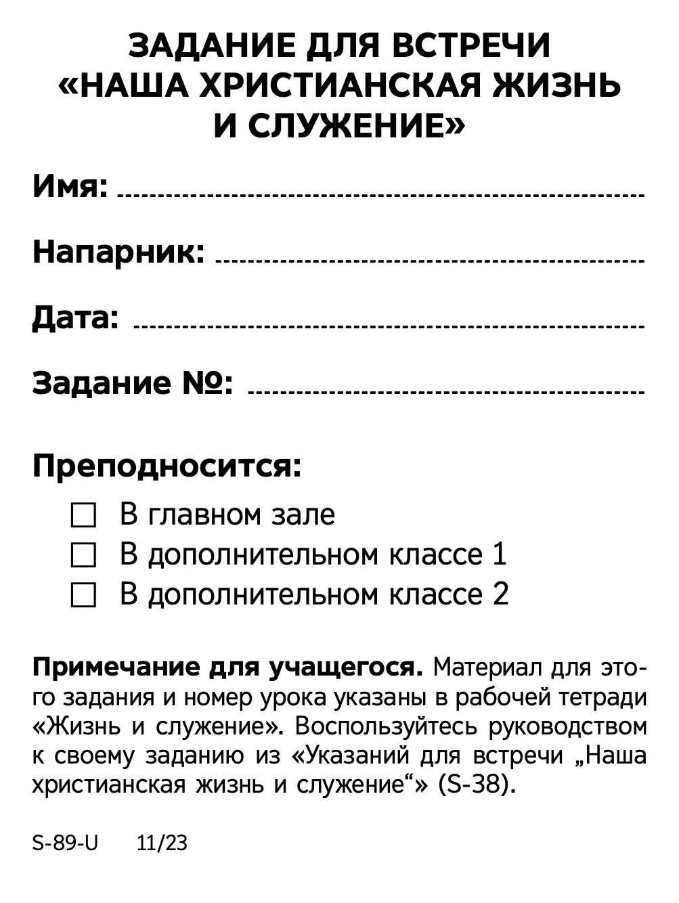

# S-89 Form Filler

Веб-приложение для автоматического заполнения бланков **S-89** (учебные задания) на основе данных экспорта из NW Scheduler в формате CSV.  
Работает полностью локально — все файлы обрабатываются прямо в браузере, ничего не отправляется на сервер.



## Возможности

- Загрузка шаблона бланка S-89 (PNG/JPG)
- Загрузка списка заданий в формате CSV:
  Date,Person,PartType,Assignment,School
- Автоматическое объединение основного выступающего и напарника
- Фильтр по датам
- Отрисовка бланка на Canvas
- Можно копировать по одному из окна предпросмотра
- Можно экспортировать все бланки в ZIP архиве
- Настройка ширины и качества JPEG
- Интерфейс на русском языке

## Как использовать

1. Открой страницу проекта:

- **Локально** — открой `index.html` в браузере.
- **Онлайн** — через [GitHub Pages](https://marhiievhe.github.io/s89-form-filler/) (если включено).

2. Выбери PNG/JPG шаблон бланка S-89.
3. Загрузите CSV с заданиями.
4. Установите с какой по каую дату вам нужны бланки.
5. Сгенерируйте превью и скачайте ZIP или копируйте вручную по списку.

## Формат CSV от NW Scheduler (писал под версию 7.8)

Обязательные столбцы:

```csv
Date,Person,PartType,Assignment,School
2025-05-05,Иван Иванов,BibleReading,Чтение Библии,1
2025-05-05,Петр Петров,Apply1,Тема выступления,1
```

Установка локально:
```bash
git clone https://github.com/MarhiievHE/s89-form-filler.git
cd s89-form-filler
```
открыть index.html в браузере
